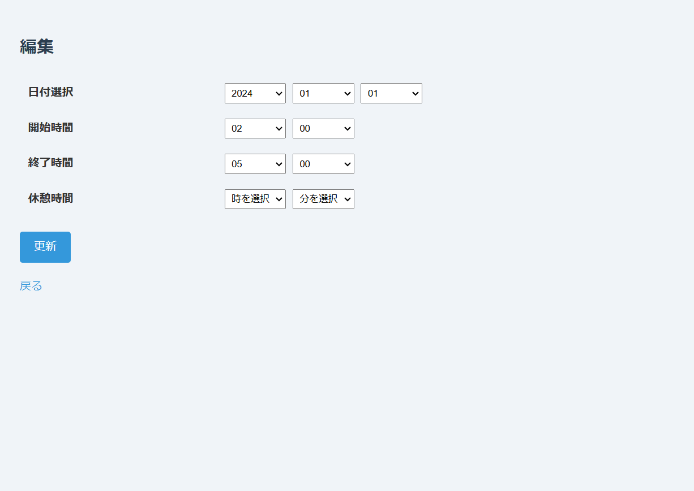

# 個人用シフト管理アプリ

## ■アプリを作ったきっかけ
様々なアルバイトを経験してきたのでシフトというものを身近に感じていて、  
自分好みのシフト管理アプリが作れたらいいなと思い、着手に至りました。

## ■画面遷移

### 1. ホーム画面

ホーム画面です。カレンダー形式にしてシフトを把握しやすくしました。

### 2. シフト新規作成画面

ユーザーがシフトを新規作成するための画面です。  
プルダウンにして選択しやすくしました。

### 3. シフト編集画面

ユーザーがシフトを編集するための画面です。  
編集前の情報が残るようにしました。

### 4. シフト詳細画面

ユーザーがシフトの詳細を確認するための画面です。  
開始時間と終了時間と休憩時間から実働時間を計算して表示します。  
シフトの編集と削除ボタンはここに配置しています。

